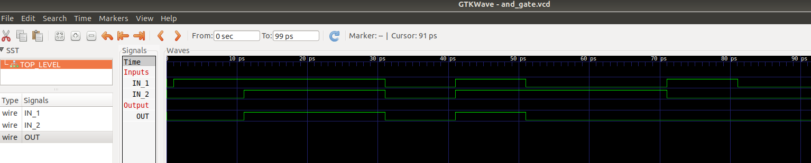
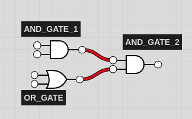
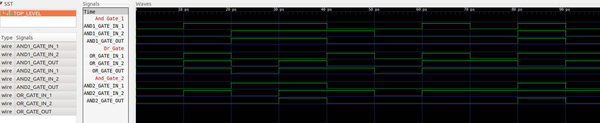
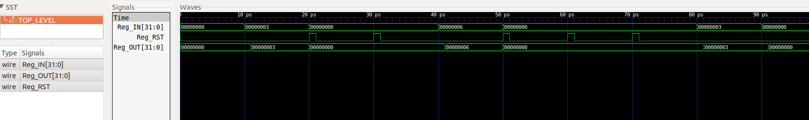

# ClockSim

Clock Based Cycle Accurate Simulation using all best practices

### Some highlights : 
1. Uses Cmake
2. Uses Unit testing using Catch
3. Uses Modern C++11 techniques, Idioms, patterns as much as possible.

### Goals : 
1. Enable rapid prototyping of Architectures
2. Excellent debug-ability and visualization capabilities just like RTL

### Examples :  

##### 1. Simple And Gate  
  
Figure 1 (above) shows the simulation of an AND gate using this cycle accurate simulation framework.  

##### 1. Simple Combinatorial circuit  
  
Figure 2.  

  
Figure 3 (above) shows the simulation of a simple combinatorial circuit (Figure 2) using multiple logic gate components.  

##### 1. Simple Register  
  
Figure 4 (above) shows the simulation of a Flop / Register which holds an Integer Value.  
Note that the output is delayed by 1 clock, and the register also features a reset option.  
